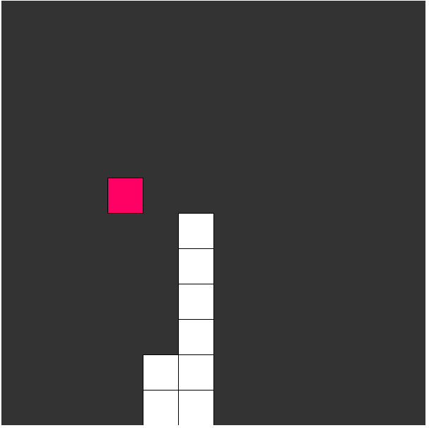

# Genetic-Algorithm-Snake
Genetic Algorithm for Snake Game Agent. Goal is to fill up the entire screen.

Snake game is a simple game in which the player moves the head of the snake up, down, right or left to eat a randomly generated food. The snake grows its size by one every time it eats the food, and the snake dies once it hits any part of its body. This project is about training an utility-based snake game agent using a genetic algorithm with a number of heuristics.  

More info can be found in my blog post. https://han-gyeol.github.io//2017/07/08/Game-AI-Snake-Game/
